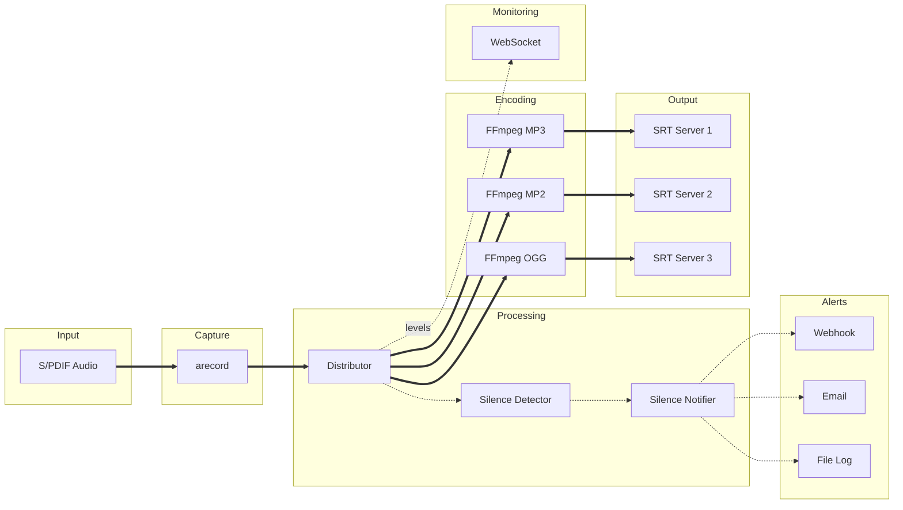
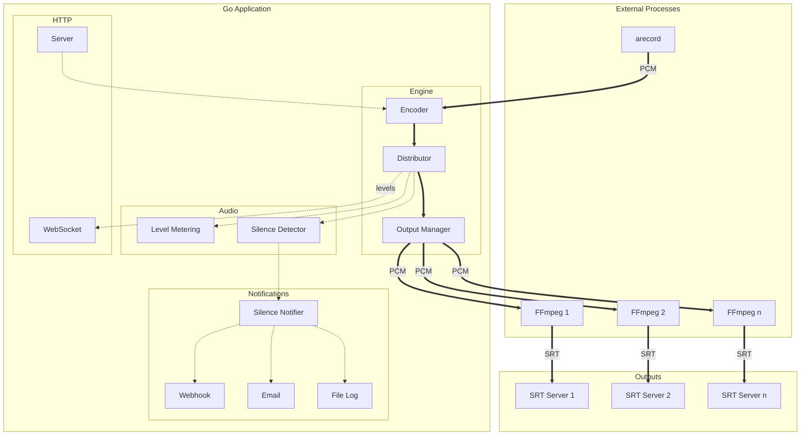

# ZuidWest FM Encoder

Audio streaming software for [ZuidWest FM](https://www.zuidwestfm.nl/) and [Radio Rucphen](https://www.rucphenrtv.nl/). Stream audio from a Raspberry Pi to multiple SRT destinations simultaneously. Built for broadcast environments with real-time monitoring and web-based configuration.


## Features

- **Multi-output streaming** - Send to multiple SRT servers with different codecs simultaneously
- **Real-time VU meters** - Peak hold (1.5 s) with peak/RMS toggle, clip detection, updated via WebSocket
- **Silence detection** - Alerts via webhook, email, or file log when audio drops below threshold
- **Web interface** - Configure outputs, select audio input, monitor levels
- **Auto-recovery** - Automatic reconnection with configurable retry limits per output
- **Multiple codecs** - MP3, MP2, Ogg Vorbis, or uncompressed WAV per output
- **Update notifications** - Alerts when new versions are available
- **Single binary** - Web interface embedded, minimal runtime dependencies

## Requirements

- Raspberry Pi 4 or 5
- [HiFiBerry Digi+ I/O](https://www.hifiberry.com/shop/boards/hifiberry-digi-io/) or [HiFiBerry DAC+ ADC](https://www.hifiberry.com/shop/boards/dacplus-adc/)
- Raspberry Pi OS Trixie Lite (64-bit)
- `ffmpeg` (for encoding)
- `alsa-utils` (for audio capture via `arecord`)

## Installation

1. Install Raspberry Pi OS Trixie Lite (64-bit)
2. Configure HiFiBerry following the [official guide](https://www.hifiberry.com/docs/software/configuring-linux-3-18-x/)
3. Run the installer as root:

```bash
sudo su
/bin/bash -c "$(curl -fsSL https://raw.githubusercontent.com/oszuidwest/zwfm-encoder/main/deploy/install.sh)"
```

The web interface will be available at `http://<raspberry-pi-ip>:8080`

**Default credentials:** `admin` / `encoder`

## Audio Input

Connect the digital output of your audio processor to the HiFiBerry input.

**Requirements:**
- 48 kHz sample rate
- 16-bit depth
- Stereo (2 channels)
- S/PDIF format preferred (AES/EBU compatibility not guaranteed)

## Codecs

| Codec | Encoder | Bitrate | Notes |
|-------|---------|---------|-------|
| MP3 | libmp3lame | 320 kbit/s | — |
| MP2 | libtwolame | 384 kbit/s | Uses psymodel 4 |
| Ogg | libvorbis | ~500 kbit/s (Q10) | — |
| WAV | pcm_s16le | Uncompressed | — |

## Silence Detection

Monitors audio levels and sends alerts when silence is detected or recovered. Uses hysteresis to prevent alert flapping:

| Setting | Default | Range | Description |
|---------|---------|-------|-------------|
| Threshold | -40 dB | -60 to 0 | Audio level below which silence is detected |
| Duration | 15 s | 1 to 300 | Seconds of silence before alerting |
| Recovery | 5 s | 1 to 60 | Seconds of audio before recovery |

**Alerting options** (can use multiple simultaneously):
- **Webhook** - POST request to a URL on silence start and recovery
- **Email** - SMTP notification to configured recipients on silence start and recovery
- **File Log** - Append JSON Lines to a local file for each silence event

Configure via the web interface under Settings → Alerts.

## Configuration

Configuration is stored in `/etc/encoder/config.json` on production systems. For development, use the `-config` flag to specify a custom path, or place `config.json` next to the binary.

```json
{
  "web_port": 8080,
  "web_user": "admin",
  "web_password": "encoder",
  "audio_input": "default:CARD=sndrpihifiberry",
  "silence_threshold": -40,
  "silence_duration": 15,
  "silence_recovery": 5,
  "silence_webhook": "https://example.com/alert",
  "silence_log_path": "/var/log/encoder/silence.jsonl",
  "email_smtp_host": "smtp.example.com",
  "email_smtp_port": 587,
  "email_username": "alerts@example.com",
  "email_password": "secret",
  "email_recipients": "admin@example.com, tech@example.com",
  "outputs": [
    {
      "id": "output-1",
      "host": "srt.example.com",
      "port": 9000,
      "streamid": "studio",
      "password": "secret",
      "codec": "mp3",
      "max_retries": 99
    }
  ]
}
```

## Architecture



On Linux, `arecord` captures audio from ALSA with minimal CPU overhead. The Go distributor calculates RMS/peak audio levels directly from the PCM stream, runs silence detection, and fans out the audio to multiple FFmpeg encoder processes. Each encoder streams to its own SRT destination. Audio levels are sent to the web interface via WebSocket, and silence events trigger configured alerts.

On macOS (for development), FFmpeg with AVFoundation is used for capture instead of arecord.

### Component Architecture



**Legend:** `══►` PCM/audio stream | `┄┄►` control/data

## Post-installation

Optional cleanup to reduce attack surface:

```bash
# Disable WiFi
echo "dtoverlay=disable-wifi" >> /boot/firmware/config.txt

# Remove unnecessary packages
apt remove bolt bluez ntfs-3g rsyslog telnet
```

## SRT Resources

- [SRT Overview (IETF)](https://datatracker.ietf.org/meeting/107/materials/slides-107-dispatch-srt-overview-01)
- [SRT Deployment Guide](https://www.vmix.com/download/srt_alliance_deployment_guide.pdf)
- [SRT 101 Video](https://www.youtube.com/watch?v=e5YLItNG3lA)

## Related

- [Liquidsoap Server](https://github.com/oszuidwest/liquidsoap-ubuntu) - Companion server software for receiving SRT streams

## License

MIT License - See [LICENSE.md](LICENSE.md)
