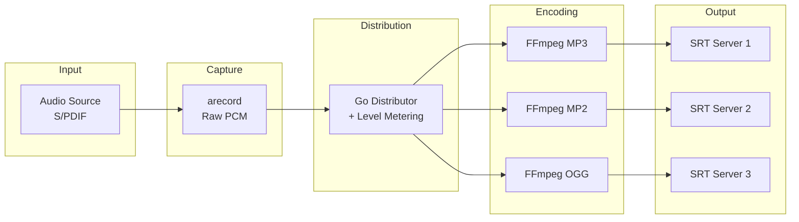

# ZuidWest FM Encoder

Audio streaming software for [ZuidWest FM](https://www.zuidwestfm.nl/) and [Radio Rucphen](https://www.rucphenrtv.nl/). Stream audio from a Raspberry Pi to multiple SRT destinations simultaneously. Built for broadcast environments with real-time monitoring and web-based configuration.


## Features

- **Multi-output streaming** - Send to multiple SRT servers with different codecs simultaneously
- **Real-time VU meters** - Peak hold (1.5s) with Peak/RMS toggle, updated via WebSocket
- **Web interface** - Configure outputs, select audio input, monitor levels
- **Auto-recovery** - Automatic reconnection with exponential backoff
- **Multiple codecs** - MP3, MP2, OGG Vorbis, or uncompressed WAV per output
- **Single binary** - Web interface embedded, minimal runtime dependencies

## Requirements

- Raspberry Pi 4 or 5
- [HiFiBerry Digi+ I/O](https://www.hifiberry.com/shop/boards/hifiberry-digi-io/) or [HiFiBerry DAC+ ADC](https://www.hifiberry.com/shop/boards/dacplus-adc/)
- Raspberry Pi OS Trixie Lite (64-bit)
- FFmpeg (for encoding)
- alsa-utils (for audio capture via arecord)

## Installation

1. Install Raspberry Pi OS Trixie Lite (64-bit)
2. Configure HiFiBerry following the [official guide](https://www.hifiberry.com/docs/software/configuring-linux-3-18-x/)
3. Run the installer as root:

```bash
sudo su
/bin/bash -c "$(curl -fsSL https://raw.githubusercontent.com/oszuidwest/zwfm-encoder/main/deploy/install.sh)"
```

The web interface will be available at `http://<raspberry-pi-ip>:8080`

**Default credentials:** `admin` / `encoder`

## Audio Input

Connect the digital output of your audio processor to the HiFiBerry input.

**Requirements:**
- 48 kHz sample rate
- 16-bit depth
- SPDIF format preferred (AES/EBU may work but is not guaranteed)

## Codecs

| Codec | Encoder | Bitrate |
|-------|---------|---------|
| MP3 | libmp3lame | 320 kbit/s |
| MP2 | libtwolame | 384 kbit/s |
| OGG | libvorbis | ~500 kbit/s (Q10) |
| WAV | pcm_s16le | Uncompressed |

## Configuration

Configuration is stored in `config.json`:

```json
{
  "web_port": 8080,
  "web_user": "admin",
  "web_password": "encoder",
  "audio_input": "default:CARD=sndrpihifiberry",
  "outputs": [
    {
      "id": "output-1",
      "host": "srt.example.com",
      "port": 9000,
      "streamid": "studio",
      "password": "secret",
      "codec": "mp3",
      "enabled": true
    }
  ]
}
```

## Architecture



On Linux, `arecord` captures audio from ALSA with minimal CPU overhead. The Go distributor calculates RMS/peak audio levels directly from the PCM stream and fans out the audio to multiple FFmpeg encoder processes. Each encoder streams to its own SRT destination.

On macOS (for development), FFmpeg with AVFoundation is used for capture instead of arecord.

## Post-installation

Optional cleanup to reduce attack surface:

```bash
# Disable WiFi
echo "dtoverlay=disable-wifi" >> /boot/firmware/config.txt

# Remove unnecessary packages
apt remove bolt bluez ntfs-3g rsyslog telnet
```

## SRT Resources

- [SRT Overview (IETF)](https://datatracker.ietf.org/meeting/107/materials/slides-107-dispatch-srt-overview-01)
- [SRT Deployment Guide](https://www.vmix.com/download/srt_alliance_deployment_guide.pdf)
- [SRT 101 Video](https://www.youtube.com/watch?v=e5YLItNG3lA)

## Related

- [Liquidsoap Server](https://github.com/oszuidwest/liquidsoap-ubuntu) - Companion server software for receiving SRT streams

## License

MIT License - See [LICENSE.md](LICENSE.md)
